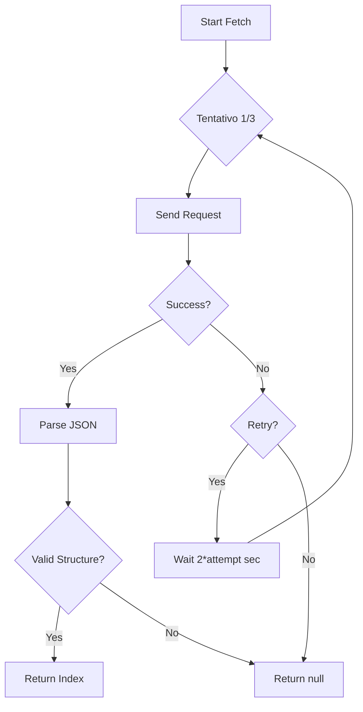

# Sistema di Estensioni Tachiyomi - Documentazione Tecnica

Questo documento spiega come funziona il sistema di estensioni di MangaFlow, compatibile con il repository Keiyoushi.

## 📋 Indice

1. [Panoramica](#panoramica)
2. [Architettura](#architettura)
3. [Formato Estensioni Tachiyomi](#formato-estensioni-tachiyomi)
4. [Servizio Fetch](#servizio-fetch)
5. [Sistema Fallback](#sistema-fallback)
6. [Implementazione Fonti](#implementazione-fonti)
7. [Aggiungere Nuove Fonti](#aggiungere-nuove-fonti)

## 🎯 Panoramica

MangaFlow implementa un sistema compatibile con le estensioni di Tachiyomi/Mihon, utilizzando il repository di Keiyoushi come fonte primaria.

### Caratteristiche Principali

- ✅ Compatibile con `index.min.json` di Keiyoushi
- ✅ Supporto multi-lingua (IT, EN, ES, JA, etc.)
- ✅ Sistema di fallback con dati mock
- ✅ Filtri NSFW (0=safe, 1=questionable, 2=explicit)
- ✅ Retry automatico su fallimenti
- ✅ Cache e gestione errori

## 🏗️ Architettura

```
┌─────────────────────────────────────────────────────────────┐
│                    Frontend (Next.js)                        │
│  ┌──────────────┐  ┌──────────────┐  ┌──────────────┐       │
│  │    Home      │  │   Explore    │  │  Settings    │       │
│  └──────┬───────┘  └──────┬───────┘  └──────┬───────┘       │
│         │                 │                 │               │
└─────────┼─────────────────┼─────────────────┼───────────────┘
          │                 │                 │
┌─────────┼─────────────────┼─────────────────┼───────────────┐
│         │      API Layer  │                 │               │
│  ┌──────▼──────┐  ┌──────▼──────┐  ┌──────▼──────┐        │
│  │ /api/manga  │  │ /api/keiyoushi│  │ /api/repos  │        │
│  └─────────────┘  └──────┬───────┘  └─────────────┘        │
└──────────────────────────┼──────────────────────────────────┘
                           │
┌──────────────────────────▼──────────────────────────────────┐
│                   Service Layer                            │
│  ┌──────────────────────────────────────────────────────┐  │
│  │   TachiyomiExtensionService                          │  │
│  │   - fetchRepoIndex()                                │  │
│  │   - getItalianExtensions()                          │  │
│  │   - filterByNSFW()                                  │  │
│  └──────────────────────────────────────────────────────┘  │
│  ┌──────────────────────────────────────────────────────┐  │
│  │   MangaSourceService                                 │  │
│  │   - searchManga()                                   │  │
│  │   - getPopularManga()                               │  │
│  │   - getChapters()                                   │  │
│  └──────────────────────────────────────────────────────┘  │
└──────────────────────────────────────────────────────────────┘
                           │
          ┌──────────────────┼──────────────────┐
          │                  │                  │
┌─────────▼────────┐  ┌─────▼──────┐  ┌──────▼──────┐
│  Keiyoushi Repo  │  │  Mock Data │  │  Database   │
│  (index.min.json)│  │  (fallback)│  │  (Prisma)   │
└──────────────────┘  └────────────┘  └─────────────┘
```

## 📄 Formato Estensioni Tachiyomi

Il file `index.min.json` del repository Keiyoushi segue questo formato:

```json
{
  "version": 2,
  "extensions": [
    {
      "name": "Tachiyomi: MangaWorld",
      "pkg": "eu.kanade.tachiyomi.extension.it.mangaworld",
      "apk": "tachiyomi-it-mangaworld-v1.4.27.apk",
      "lang": "it",
      "code": 27,
      "version": "1.4.27",
      "nsfw": 0,
      "icon": "ic_launcher.webp",
      "sources": [
        {
          "id": "mangaworld",
          "lang": "it",
          "name": "MangaWorld",
          "baseUrl": "https://www.mangaworld.bz"
        }
      ]
    }
  ]
}
```

### Campi Spiegati

| Campo | Tipo | Descrizione |
|-------|------|-------------|
| `name` | string | Nome completo dell'estensione |
| `pkg` | string | Nome del package (unique ID) |
| `apk` | string | Nome file APK |
| `lang` | string | Codice lingua (it, en, all, etc.) |
| `code` | number | Version code (int) |
| `version` | string | Version name (string) |
| `nsfw` | number | Livello NSFW (0, 1, 2) |
| `icon` | string | Nome file icona |
| `sources` | array | Lista delle fonti manga |

## 🔍 Servizio Fetch

### TachiyomiExtensionService

Il servizio gestisce il fetch del repository con:

```typescript
static async fetchRepoIndex(
  repoUrl: string = this.DEFAULT_REPO
): Promise<TachiyomiRepoIndex | null>
```

#### Caratteristiche

1. **Retry Automatico**: 3 tentativi con delay crescente
2. **Timeout**: 15 secondi per richiesta
3. **AbortController**: Cancella richieste pendenti
4. **Validazione**: Verifica struttura della risposta

#### Flusso



### Esempio di Utilizzo

```typescript
const index = await TachiyomiExtensionService.fetchRepoIndex();

if (index) {
  const italianExts = TachiyomiExtensionService.getItalianExtensions(index.extensions);
  console.log(`Found ${italianExts.length} Italian extensions`);
}
```

## 🛡️ Sistema Fallback

Quando il repository non è accessibile (firewall, rete limitata, etc.), il sistema usa automaticamente i dati mock definiti in `src/lib/mock-extensions.ts`.

### Attivazione Fallback

Il fallback è attivato automaticamente nell'API `/api/keiyoushi`:

```typescript
// Try to fetch from Keiyoushi repository
index = await TachiyomiExtensionService.fetchRepoIndex();

// Fallback to mock data if fetch fails
if (!index) {
  console.log('Repository not accessible, using mock data');
  index = MOCK_KEIYOSHI_EXTENSIONS;
}
```

### Dati Mock Includono

- 2 estensioni italiane (MangaWorld, MangaWorld In)
- 7 estensioni internazionali
- Tutti i campi necessari per il funzionamento
- Structure identica al reale `index.min.json`

### Forzare Mock

Puoi forzare l'uso dei dati mock aggiungendo `?mock=true`:

```bash
GET /api/keiyoushi?lang=it&mock=true
```

La risposta include un flag `isMock: true` per indicare l'uso dei dati mock.

## 🌐 Implementazione Fonti

### MangaSourceService

Il servizio implementa scraper per le varie fonti manga.

#### Architettura Scraper

```typescript
abstract class BaseScraper {
  abstract searchManga(query: string): Promise<MangaInfo[]>;
  abstract getPopularManga(): Promise<MangaInfo[]>;
  abstract getLatestManga(): Promise<MangaInfo[]>;
  abstract getMangaDetails(url: string): Promise<MangaInfo | null>;
  abstract getChapters(mangaUrl: string): Promise<ChapterInfo[]>;
  abstract getChapterPages(chapterUrl: string): Promise<MangaPage[]>;
}
```

#### MangaWorld Scraper

Attualmente implementato con dati mock, ma strutturato per parsing reale:

```typescript
class MangaWorldScraper {
  static readonly BASE_URL = 'https://www.mangaworld.bz';

  static async searchManga(query: string): Promise<MangaInfo[]> {
    // In production: parse HTML from search results
    return this.getMockMangaData().filter(/* ... */);
  }

  static async getChapters(mangaUrl: string): Promise<ChapterInfo[]> {
    // In production: extract chapter list from manga page
  }

  static async getChapterPages(chapterUrl: string): Promise<MangaPage[]> {
    // In production: extract image URLs from chapter page
  }
}
```

### Implementazione Reale HTML Parsing

Per implementare il parsing reale, useresti un parser HTML come `cheerio`:

```typescript
import * as cheerio from 'cheerio';

static async getChapters(mangaUrl: string): Promise<ChapterInfo[]> {
  const response = await fetch(mangaUrl);
  const html = await response.text();
  const $ = cheerio.load(html);

  const chapters: ChapterInfo[] = [];

  $('.chapter-item').each((_, el) => {
    const chapterNum = parseFloat($(el).find('.num').text());
    const name = $(el).find('.title').text();
    const url = $(el).find('a').attr('href');

    chapters.push({
      id: generateId(url),
      mangaId: extractMangaId(mangaUrl),
      chapterNum,
      name,
      url: new URL(url, this.BASE_URL).href,
    });
  });

  return chapters;
}
```

## ➕ Aggiungere Nuove Fonti

### 1. Crea il Nuovo Scraper

```typescript
// src/lib/scrapers/my-source.ts
import { BaseScraper, MangaInfo, ChapterInfo, MangaPage } from '../types';

export class MySourceScraper {
  static readonly BASE_URL = 'https://example.com';

  static async searchManga(query: string): Promise<MangaInfo[]> {
    // Implementa ricerca
  }

  static async getChapters(mangaUrl: string): Promise<ChapterInfo[]> {
    // Implementa lista capitoli
  }

  static async getChapterPages(chapterUrl: string): Promise<MangaPage[]> {
    // Implementa pagine capitolo
  }
}
```

### 2. Registra lo Scraper

```typescript
// src/lib/manga-source-service.ts
import { MySourceScraper } from './scrapers/my-source';

MangaSourceService.registerScraper('mysource', MySourceScraper);
```

### 3. Aggiungi ai Mock Extensions

```typescript
// src/lib/mock-extensions.ts
{
  name: 'Tachiyomi: MySource',
  pkg: 'eu.kanade.tachiyomi.extension.it.mysource',
  apk: 'tachiyomi-it-mysource-v1.0.0.apk',
  lang: 'it',
  code: 1,
  version: '1.0.0',
  nsfw: 0,
  icon: 'ic_launcher.webp',
  sources: [
    {
      id: 'mysource',
      lang: 'it',
      name: 'My Source',
      baseUrl: 'https://example.com',
    },
  ],
}
```

### 4. Testa l'Integrazione

```bash
# Testa le estensioni
curl "http://localhost:3000/api/keiyoushi?lang=it"

# Testa la ricerca manga
curl "http://localhost:3000/api/manga?query=onepiece"
```

## 📊 API Reference

### GET /api/keiyoushi

Recupera le estensioni con fallback automatico.

**Query Parameters:**
- `lang`: Filtro lingua (default: `all`)
- `mock`: Forza mock data (default: `false`)

**Response:**
```json
{
  "version": 2,
  "totalExtensions": 9,
  "filteredExtensions": 2,
  "languages": ["all", "en", "es", "it", "ja"],
  "isMock": true,
  "extensions": [...],
  "popularItalianSources": [...]
}
```

### POST /api/keiyoushi

Testa connessione al repository.

**Request Body:**
```json
{
  "repoUrl": "https://raw.githubusercontent.com/keiyoushi/extensions/repo/index.min.json"
}
```

**Response:**
```json
{
  "success": true,
  "version": 2,
  "totalExtensions": 1000,
  "italianExtensions": 45,
  "languages": ["all", "ar", "cs", "de", "en", "es", "fr", "id", "it", ...]
}
```

## 🔧 Troubleshooting

### Repository Non Accessibile

**Sintomo:** Tutte le chiamate restituiscono `isMock: true`

**Soluzioni:**
1. Verifica connessione internet
2. Controlla firewall
3. Usa VPN se necessario
4. Il sistema userà automaticamente i dati mock

### Estensioni Non Appaiono

**Sintomo:** Lista estensioni vuota

**Cause:**
1. Nessuna estensione per la lingua richiesta
2. Filtro NSFW troppo restrittivo
3. Dati mock non includono quella lingua

**Soluzioni:**
1. Prova `?lang=all`
2. Rimuovi filtro NSFW
3. Verifica mock data

### Errori di Parsing

**Sintomo:** `Invalid repo index structure`

**Cause:**
1. URL del repository errato
2. Repository formato non compatibile
3. JSON corrotto

**Soluzioni:**
1. Usa URL Keiyoushi ufficiale
2. Verifica formato JSON
3. Controlla console per errori

## 📚 Riferimenti

- [Keiyoushi Extensions](https://github.com/keiyoushi/extensions)
- [Keiyoushi Extensions Source](https://github.com/keiyoushi/extensions-source)
- [Tachiyomi Extension Format](https://tachiyomi.org/help/guides/find-extensions/)
- [MangaDex API](https://api.mangadex.org/docs)

## 🤝 Contribuire

Per aggiungere supporto per nuove fonti:

1. Crea issue per proporre la fonte
2. Implementa lo scraper seguendo il pattern
3. Aggiungi test
4. Aggiorna documentazione
5. Submit PR

---

**Nota:** Usa sempre il sistema di mock per lo sviluppo e i test. Implementa i parser reali solo quando necessario e rispettando i ToS delle fonti.
